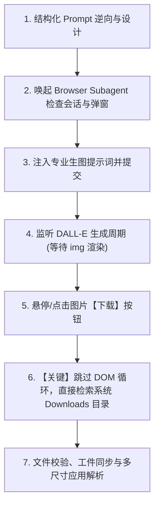

# ChatGPT Image Generator Skill

本技能规范了通过 **Browser Subagent** 协同 **ChatGPT (DALL-E)** 进行高质量图像/Logo生成、自动化下载与本地文件归集的完整工作流，并特别沉淀了避开“浏览器静默下载导致 Agent 死循环”的关键实践。

---

## 核心工作流体系



---

## 极速执行方案：两阶段解耦驱动 (`./scripts/chatgpt_fast_generate.js`)

为贯彻“**一切为了效率**”原则与“**两阶段清晰解耦**”理念，本 Skill 内置了经实战淬炼的自动化执行脚本 [chatgpt_fast_generate.js](scripts/chatgpt_fast_generate.js)。

### 核心特性与架构职责划分：
1. **阶段一（监控脚本负责）：`runGenerateAndWatch(promptText)`**
   - **【选区注入与真实提交】**：使用 Selection API 聚焦光标并通过原生事件兜底，确保富文本框百分之百真实输入并触发发送；
   - **【循环高频秒关守护器】**：启动 200ms 微间隔定时器巡检，**无论弹窗在第 0 秒、第 15 秒（生图中）还是生成完毕瞬间随机弹出、多次弹出，瞬间自动点击【明白了】销毁**，页面对遮罩完全免疫；
   - **【零等待图片监听】**：500ms 高频检测全新 DALL-E 图片（`naturalWidth > 300` 且 `complete`），一旦生成完毕立即返回完成状态。
2. **阶段二（独立下载流程负责）：`triggerImageDownload()`**
   - 监控脚本返回 `image_ready` 后，立即执行独立下载动作；
   - 优先点击原生【保存/下载】按钮直接写入系统 `Downloads`，并由主控直接检索落盘，彻底跳过网页 DOM 循环。

### 关键派发规范（【严禁让 Subagent 现场拆解为多轮慢速交互】）：
> **核心规范**：主 Agent 指令 Browser Subagent 时，**严禁使用口头多步分段指令（“1.输入... 2.等待... 3.点击...”）**！因为这会导致 Subagent 来回调用 8~12 次工具，每次产生 20~30 秒的 LLM 思考与网络延迟。  
> **正确姿势**：主 Agent 将脚本中的自包含函数直接发给 Subagent：
> - 步骤 1：调用一次 `evaluate_script` 运行阶段一脚本（输入、发送、秒关随时弹窗、监控出图）；
> - 步骤 2：脚本返回完成后，调用一次 `triggerImageDownload()` 触发保存，等待 2 秒直接汇报！

```javascript
// 阶段一：输入、秒关守护、出图监听
const res = await window.runGenerateAndWatch(promptText, { timeoutMs: 120000 });
// res 返回: { success: true, status: 'image_ready', durationMs: 42000, imageSrc: "..." }

// 阶段二：独立下载触发
window.triggerImageDownload();
```

---

## 详细执行阶段

### 阶段一：专业级生图 Prompt 设计 ——【核心军规：只提要求，不限内容，充分放权】

> **【至高准则】使用 GPT / DALL-E 生图时，必须坚持“只提硬性要求，绝不规定具体内容”，最大化激发模型原生设计与创意推理能力！**  
> GPT 4o / DALL-E 3 具备顶尖的视觉美学、空间构图与概念隐喻能力。**最致命的反模式是“保姆式微观微操”**（过度规定每个区域画什么、有哪些元素、写什么字），这会严重束缚模型的想象空间，导致出图僵硬、构图拥挤甚至产生认知冲突。

#### 1. 黄金分工原则：Agent vs GPT

| 维度 | Agent 的职责（【只提要求/约束】） | GPT 的职责（【自主构思具体内容】） |
| :--- | :--- | :--- |
| **业务场景与受众** | 明确核心业务目标、受众与场景（如：为某社区家庭设计的周边游攻略图 / 某技术产品Logo） | 自主构思故事背景、情感共鸣点与主题意象 |
| **文字与语言约束** | 明确文字语言要求（如：必须全简体中文、工整无乱码 / 或纯图形无多余文字） | 自主拟定具体的文案标题、标语、小贴士与说明文案 |
| **风格与基调意向** | 提出基准风格与调性（如：温暖治愈手绘手帐风、现代极简扁平科技风、复古像素风） | 自主决定具体色彩搭配、材质肌理、光影质感与艺术笔触 |
| **构图与内容元素** | **【严禁规定】** 绝不限制画几个元素、摆在哪个角落、具体是哪些景点道具 | **【充分放权】** 自主决定版面布局、信息动线、地标选择与装饰小细节 |

#### 2. 提示词黄金公式与万能模版

$$\text{Prompt} = \text{核心业务主体/受众} + \text{核心约束要求（文字/风格/基调）} + \text{显式放权与创意激励语}$$

**万能放权提示词模板：**
```text
请充分发挥你的创意灵感与顶尖视觉设计审美，为【业务主题/目标群体】设计并生成一张【风格基调】的【交付物形态】。

【核心要求】：
1. 文字规范：[明确指定：文字全部使用规范工整的简体中文，字迹清晰 / 或纯图形无多余文字]；
2. 风格与调性：[指定整体艺术风格与色彩氛围，如：温暖治愈手绘旅行手帐风 / 现代高级极简信息图]；
3. 核心诉求：以【核心起点/核心业务】为探索中心，展现【想要传递的价值/场景氛围】；
4. 充分放权：具体包含的场景元素、地标选择、版面构图与视觉细节，请完全交由你自主构思与排版设计！
```

#### 3. 正反典范对照

* ❌ **错误反模式（过度规定内容、死板微操、束缚模型）**：
  > “请画一张周边游图，左上角必须画A景点，里面画两座山一挂瀑布，瀑布下画三个小孩拿绿网捞鱼；右上角必须画B景点，上面写三个字，门楼高5米，左边有一只红黄相间的狮子踩在第五根桩上；下面画一条江，左边是一艘乌篷船，右边画一个欧式城堡和一个红色摩天轮……”  
  > *后果：模型计算力被冗杂甚至冲突的微观指令锁死，构图生硬拥挤，画面割裂失真。*

* ✅ **正确典范（只提要求，不限内容，激发智慧）**：
  > “请充分发挥你的创意与审美设计能力，为居住在【佛山南海西樵西岸社区】的家庭，自主设计并生成一张高颜值、温馨治愈的手绘插画风【亲子周边游全景攻略地图】。  
  > 要求：文字必须全部使用规范工整的简体中文；以西岸社区为出发原点，辐射周边亲子戏水、岭南名山水乡与度假乐园等场景；具体包含的精选地标、排版构图与动线细节，请完全交由你自主构思发挥！”  
  > *结果：模型自主构思出全景手帐风，自发提炼出‘核心玩水圈’‘岭南名山圈’‘水乡慢游圈’‘度假乐园圈’，并自动补充了出行贴士与暖心手帐语，构图平衡，惊艳出彩！*

---

### 阶段二：浏览器会话接入与弹窗清理
1. **启动或复用 Browser Subagent**：
   - 导航至 `https://chatgpt.com/`。
   - 若遇到未登录状态，以有头（Headed）模式打开，提示用户在弹出的窗口中手动完成 Google / Apple / 微软 / 邮箱登录。
2. **清理遮罩浮层（Onboarding & Rate Limit Modals）**：
   - **自动点击“明白了”**：检测是否弹出【请求过于频繁】风控弹窗（“为保障数据安全，我们已暂时限制你访问对话记录”）。若出现，**立即点击【明白了】按钮关闭遮罩**，当前对话即可恢复正常交互！
   - **关闭其他提示**：检测并关闭任何“欢迎使用”、“提示”、“保持登录”等模态弹窗，确保主对话界面的输入框无任何蒙层遮挡。
   - **硬限流极速绕过**：若关闭后发现输入框依然锁定（无法聚焦），直接导航至 `https://chatgpt.com/?temporary-chat=true` 或点击左上角“开启新对话”，无需等待几分钟！

---

### 阶段三：消息提交与生成状态监听
1. **注入 Prompt**：
   - 定位输入框：`#prompt-textarea` 或 `div[contenteditable="true"]`。
   - 注入精心调优的生图提示词，点击发送按钮（或触发 Enter）。
2. **状态监测**：
   - 等待 ChatGPT 响应流结束。
   - 轮询等待 DALL-E 图片生成占位符（Shimmer/Spinner）转变为完整的 `` 标签，确认图片已完全加载渲染。

---

### 阶段四：下载与本地文件检索（【核心避坑规范】）

> **【极高优先级警示】为什么不能在 DOM 中死循环寻找下载状态？**  
> 在 ChatGPT 网页中，用户点击图片的【下载】按钮后：
> 1. Chrome 浏览器会在底层**毫秒级直接触发系统下载**，文件会自动以 `ChatGPT Image YYYY年M月D日 HH_MM_SS.png` 的命名保存到本机的 `Downloads` 文件夹中。
> 2. 但在网页 DOM 中，**页面不会发生任何路由跳转、弹窗提示或属性变更**。
> 3. **典型反模式（Anti-Pattern）**：Agent 点击下载后，一直试图在网页 DOM 里查找“下载成功”标记或通过 `fetch` 拦截，导致死循环直至超时或被用户取消。

**标准化下载动作**：
1. **触发下载**：在图片区域悬停（Hover）或点击放大图片，点击右上角出现的【下载 / Download】按钮。
2. **等待落盘**：等待 2~3 秒，让操作系统将文件从缓冲区写入磁盘。
3. **直接跳出浏览器，检索本地文件系统**：
   通过终端命令直接检索本机 Downloads 目录：
   ```powershell
   # Windows PowerShell
   $file = Get-ChildItem -Path "$env:USERPROFILE\Downloads" -Filter "*ChatGPT Image*" | Sort-Object LastWriteTime -Descending | Select-Object -First 1
   ```
4. **归集到工件/工程目录**：
   将该图片复制到当前项目的资源目录或 Conversation Artifacts 中：
   ```powershell
   Copy-Item -Path $file.FullName -Destination "<ArtifactDir>\logo.png" -Force
   ```
5. **工件展示与路径防裂规范（【核心防坑】）**：
   - 向用户或 Markdown/HTML 展示图片时，**必须统一使用正斜杠 `/` 或 Web 协议格式**（例如 `` 或 `file:///C:/Users/.../logo.png`，或嵌入 `<agent-embed>` 组件）；
   - **绝对禁止使用未转义的 Windows 反斜杠 `\`**（如 `C:\Users\...\brain` 中的 `\b` 会被 Markdown 解析器当成退格转义符导致图片裂开无法加载！）。

---

### 阶段五：设计交付与后台应用建议
不仅交付图片文件，还需提供设计解构说明：
- **符号寓意拆解**：解释各视觉元素的业务映射；
- **尺寸适配规范**：提供不同场景（Navbar 32px、Favicon 16px、Avatar 48px、Splash 256px）的视觉落地建议。

---

## 常见异常排查手册 (Troubleshooting)

| 问题场景 | 原因诊断 | 标准解决方案 |
| :--- | :--- | :--- |
| **弹出【请求过于频繁】遮罩弹窗** | 短时间内高频操作或新开标签页请求 `backend-api` 触发了前端访问频率风控（提示“已暂时限制访问对话记录”） | **1. 自动毫秒级关闭**：执行脚本自动检索并点击【明白了】按钮（`button: has-text("明白了")`），清除页面遮罩。<br/>**2. 极速绕过技巧**：该限制通常仅针对历史侧边栏。点掉弹窗后若当前会话无法输入，**直接导航至临时会话 `https://chatgpt.com/?temporary-chat=true` 或点击“新建对话”**，无需死等几分钟，立即恢复满速生图！ |
| **Subagent 卡在下载环节不汇报** | 浏览器已静默下载，但 Agent 试图在网页 DOM 中反复求证 | **立刻检查系统 Downloads 文件夹**，匹配最新写入的 `ChatGPT Image *.png`，直接完成同步并跳出。 |
| **Markdown 图片渲染裂开** | Windows 反斜杠 `\` 中的 `\b`（如 `\brain`）或 `\u` 等被 Markdown 语法当作转义控制字符破坏了图片路径 | **将图片路径统一转换为正斜杠 `/`**（如 `/C:/Users/.../image.png` 或 `file:///C:/Users/...`），或编写轻量 HTML 组件通过 `<agent-embed>` 加载。 |
| **生图失败 / 内容审查警告** | 提示词触碰了 DALL-E 内容合规关键词（敏感词、特定商业商标、暴力等） | 调整 Prompt，将具象人物或敏感概念替换为抽象几何、通用商务科技隐喻。 |
| **生成的文字乱码或拼写错误** | AI 绘图引擎对长文本渲染天然存在瑕疵 | 严禁让 AI 生成复杂英文长句。要求其“纯图形输出，无杂乱文字”（No text in icon），文字在管理后台前端由标准 Web Font 拼装。 |
| **会话失效 / Cloudflare 拦截** | 登录态过期或触发高频风控 | 切换为可见（Headed）窗口，提示用户点击人工完成人机验证。 |
