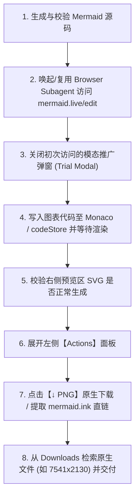

# Mermaid Diagram Generator Skill

本技能规范了利用 Browser Subagent 访问 Mermaid Live Editor 在线绘制图表并导出原生超高清图片的标准自动化流程。

---

## 核心工作流概述



---

## 详细执行步骤

### 步骤 1：准备与校验 Mermaid 源码
- 编写符合 Mermaid 规范的图表代码（如 `graph TD`, `sequenceDiagram`, `classDiagram` 等）。
- 确保节点标签中若包含特殊字符（如括号、斜杠、空格），务必使用引号包裹，例如：`Node1["客户端与网关层 (Clients & Gateway)"]`。

### 步骤 2：启动/复用 Browser Subagent
通过 `invoke_subagent` 或复用现有空闲的 `browser` 子代理：
```json
{
  "Subagents": [{
    "TypeName": "browser",
    "Role": "Mermaid Automation Agent",
    "Prompt": "导航至 https://mermaid.live/edit，准备输入图表代码并导出高清图片。",
    "Model": "inherit",
    "Workspace": "inherit"
  }]
}
```

### 步骤 3：处理页面初始弹窗
Mermaid Live Editor 首次加载时通常会弹出一个全屏推广弹窗（"Try the full Mermaid experience" 或 "Try Mermaid Advanced Editor"）：
- 查找并点击关闭按钮（通常是 `Close` 按钮或 `Stay on mermaid.live`）。
- 确保弹窗消失，避免遮挡编辑器和 Actions 面板的后续点击交互。

### 步骤 4：注入图表代码并重新渲染
在页面中更新图表内容，推荐以下方式：
1. **DOM / localStorage 注入（最稳定）**：
   通过 `evaluate_script` 直接更新编辑器的存储状态并触发重新渲染：
   ```javascript
   () => {
     const state = JSON.parse(localStorage.getItem('codeStore') || '{}');
     state.code = `YOUR_MERMAID_CODE_HERE`;
     localStorage.setItem('codeStore', JSON.stringify(state));
     window.location.reload();
   }
   ```
2. **Monaco API 直接设置**：
   若 Monaco 实例已挂载，调用 `monaco.editor.getModels()[0].setValue(code)`。

### 步骤 5：等待渲染确认
- 检查右侧预览区 DOM 树中是否生成了 `svg` 或 `graphics-document` 元素。
- 确认页面未出现红色的 Mermaid 语法解析错误条（Error Alert）。

### 步骤 6：导出原生超高清架构图（核心方案选择）
> **【重要实践经验】为什么不优先模拟点击下载按钮？**  
> Mermaid Live Editor 的【↓ PNG】按钮底层是通过前端 JavaScript 异步向 `mermaid.ink` 请求并将二进制转为 `blob:` URL，再动态创建 `<a download>` 触发下载。在自动化浏览器（CDP / Playwright）中，这种下载行为受限于浏览器的安全沙箱机制（若未精确配置 `Page.setDownloadBehavior`，下载事件极易被静默拦截或无法追踪完成状态）。  
> **因此，最健壮、最可靠的自动化方案是“官方直链提取（Direct Stream Fetch）”**。

1. **展开 Actions 卡片**：
   - 确认左侧面板中的 `Actions` 卡片已展开（若折叠则点击标题展开）。
2. **获取导出图片**（推荐方案 A，方案 B 作为备选）：
   - **方案 A（首选：mermaid.ink 官方渲染源直提，100% 稳定）**：
     - 在 Actions 面板中获取已编码的渲染直链：`https://mermaid.ink/img/pako:<HASH>?type=png`。
     - 直接通过浏览器环境 `fetch(url)` 获取二进制 ArrayBuffer，或直接在新标签页打开该纯净图片页面并保存为全尺寸 PNG。
     - **优势**：绝对稳定、免受浏览器文件下载拦截、纯白底无杂质、分辨率高达原图上限（如 1695×1880、7500+ 像素）。
   - **方案 B（备选：模拟点击【↓ PNG】下载按钮）**：
     - 适合有头模式且需要直接将文件丢进用户系统 `Downloads` 文件夹的场景。
     - 需提前确保 Chrome 会话具备下载写权限，点击后在 `C:\Users\<USER>\Downloads\` 检索 `mermaid-diagram-*.png`。

### 步骤 7：文件检索与工件交付
1. 检查下载路径：
   - Windows 默认路径：`C:\Users\<USER>\Downloads\`
   - 筛选最新生成的 `mermaid-diagram-*.png`。
2. 将下载的高清图复制或移动至当前会话的工件目录（Artifact Directory）以便持久化和引用：
   ```powershell
   Copy-Item -Path "C:\Users\<USER>\Downloads\mermaid-diagram-*.png" -Destination "<ArtifactDir>\diagram.png" -Force
   ```
3. 在回复或 Markdown 工件中向用户呈现该图片链接与详细架构说明。

---

## 故障排查与最佳实践 (Pitfalls & Tips)

| 场景 / 问题 | 解决方案 |
| :--- | :--- |
| **导出的图片带浏览器 UI / 白边过多** | 严禁使用 `take_screenshot`。务必展开左侧 `Actions` 面板点击 `【↓ PNG】` 由渲染引擎输出原生图。 |
| **找不到 Actions 面板中的 PNG 按钮** | 检查 `Sample Diagrams` 是否把 `Actions` 挤占或折叠了。点击 `Actions` 标题栏使其展开为 `.isOpen`。 |
| **初次进入页面无法点击** | 页面存在模态遮罩层（Dialog）。先检测并关闭模态框。 |
| **复杂图表渲染模糊** | 在 Actions 面板中将 `PNG size` 从 `Auto` 切换为指定 `Width`，或直接点击 `【↓ SVG】` 导出矢量图。 |
